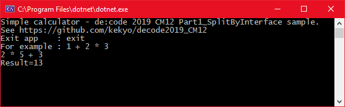

# de:code 2019 CM12 - Interoperability of .NET assemblies.

このリポジトリは、2019年5月に東京で開催される[「de:code 2019」](https://www.microsoft.com/ja-jp/events/decode/2019/default.aspx)のセッション[「CM12: .NET Core マルチプラットフォームの本質」](https://www.microsoft.com/ja-jp/events/decode/2019session/detail.aspx?sid=CM12)に対応するサンプルコードと解説を公開しています。

* 本記事はKouji Matsuiが独自に構成、執筆したものであり、[「Microsoft MVPパーソナルスポンサー」](https://www.microsoft.com/ja-jp/events/decode/2019/sponsor.aspx)として提供するものです。de:code 2019のオフィシャルドキュメントではありません。
* 本記事執筆時には、セッションの概要のみ公開されているため、内容が密接に連携しない場合があります。
* ライセンスは外部参照を除き、MITとします。

# 概要

.NETにおけるマルチプラットフォーム対応を支えるための、アセンブリレベルでの互換性の対処方法について、サンプルコードと解説を行います。

* マネージドサイド
  * インターフェイス分離
  * Bait and switchテクニック
* アンマネージド連携
  * P/Invoke
  * P/Invoke DLL連携の詳細
* ランタイムサイド
  * FCall
  * QCall

# マネージドサイド

マルチプラットフォーム戦略で最も一般的に使用されるテクニックは、インターフェイス分離と依存注入(Dependency Injection)でしょう。

## インターフェイス分離

インターフェイス分離は最も基本的なテクニックです。.NETのインターフェイス型を使用して、異なる実装の詳細を、同一の(広義の)インターフェイスで分離する事により、それぞれをマルチプラットフォームに対応した処理として共通に扱えるようにします。

[SeparatesByInterfaceTypeプロジェクト](Part1_SeparatesByInterfaceType)は、以下の機能を持ちます:

* 複数の値を入力すると、計算結果が出力される。
* 入出力の対象は、コンソール(コマンドライン)と、GUI(WPF, Avalonia)である。

ConsoleCalculatorの実行結果:

WPFの実行結果:

ここでは依存注入を、手動での注入(メソッド引数で直接注入する)を行っています(より発展した例としては、MEFや各種依存注入ライブラリを併用することが考えられますが、ここでは割愛します)。このサンプルコードで重要な点を以下に挙げます:

* 計算を実行する本体(Calculator)ライブラリは、プラットフォーム中立であり、netstandard2.0としてビルドしている。
* Calculatorライブラリには、コンソールやGUIへの入出力コードは一切含まれていない。

## Bait and switchテクニック

# アンマネージド連携

## P/Invoke
## P/Invoke DLL連携の詳細

# ランタイムサイド

## FCall
## QCall
